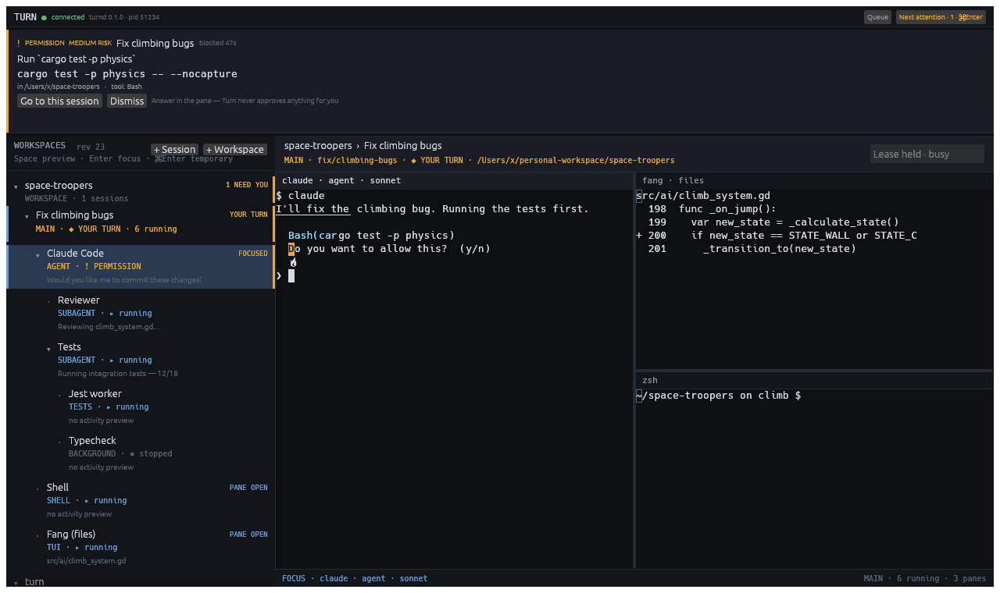

<div align="center">

# Turn

### Run agents in parallel. Step in when it's your turn.

Turn is a desktop terminal workspace for running, organising, and supervising AI coding agents.
It keeps agents, shells, TUIs, and background work organised—and brings you back only when a task
actually needs attention.

[](https://github.com/TheBurrowHub/turn/actions/workflows/ci.yml)
[](rust-toolchain.toml)
[](#platform-support)
[](#license)

</div>



## Why Turn

Traditional terminals organise windows and tabs. Turn organises work.

A **Workspace** represents a persistent project. Each **Session** represents one task inside it. Agents,
subagents, shells, test runners, servers, and TUIs live in a single hierarchy, while the centre of the
window contains only the panes you chose to open.

When several agents work in parallel, Turn distinguishes activity from intervention. Finishing a tool
call is not the same as asking a question; completing an agent turn is not the same as exiting a process.
Actionable demands enter one ordered **Attention Queue**, so multiple agents never fight over focus.

## What makes it different

| Capability | Turn's approach |
| --- | --- |
| Unified navigation | One searchable `Workspace → Session → Agent/Tool → Child` tree with durable filters, density, ordering and viewport |
| Background subagents | Discovered under their parent without opening panes, changing layout, or stealing focus |
| Agent handoffs | Review a bounded, redacted context packet and explicitly pass it to another Agent in the same Session |
| Attention management | Per-session policies, badges, notifications, and one ordered Next Attention action |
| Real terminal workloads | PTYs with ANSI colour, alternate screen, mouse input, resize, bounded durable scrollback, shells, and TUIs |
| Stable layouts | Nested splits, reusable presets, drag-to-reorder, resize, balance, zoom, and per-session persistence |
| Checkout safety | One host-global write owner per checkout across data dirs; extra sessions are read-only or isolated in worktrees |
| Honest recovery | Restore layout and metadata without silently rerunning saved commands or destructive work |
| Integration without forks | Structured hooks where available, wrappers and heuristics where useful, generic terminal otherwise |

## Agent and tool support

- **Claude Code** — structured hooks plus terminal/process observation.
- **OpenAI Codex CLI** — structured hooks and notifications, with graceful fallback.
- **Gemini CLI** — dedicated hook adapter with explicit capability/degradation reporting.
- **OpenCode** — dedicated plugin/session adapter with explicit capability/degradation reporting.
- **Other agent CLIs** — run through the generic terminal adapter even without a dedicated integration.
- **Shells and TUIs** — ordinary interactive processes remain first-class: shells, test runners, servers,
  logs, file explorers, `lazygit`, `btop`, and similar tools.

An absent integration never prevents a command from running. It only changes how confidently Turn can
describe its semantic state.

## Current status

Turn is an early-stage product with a working vertical, not a finished distribution.

Implemented today:

- Native GPU desktop window written in Rust.
- Workspace and Session creation with an optional task name.
- Portable first-run preset: two shell columns, with no dependency on optional tools.
- Visual layout editor and reusable layout presets.
- Persistent PTYs, terminal panes, process hierarchy, subagent previews, and temporary panes that can be
  promoted into remembered permanent placement without restarting their process.
- Optional contextual inspectors for Workspace, Session, Agent, and Process rows, with safe bounded
  history, readable parent links, confidence labels, runtime facts, and contextual actions.
- Review-before-send context handoffs between controllable Agents in one Session.
- Claude Code, Codex, Gemini and OpenCode adapter infrastructure.
- Attention policies, permission context, queue ordering, and typing-aware focus protection.
- Live font/zoom controls, a measured high-contrast palette, reduced-motion support,
  modal AccessKit semantics, separate state/selection/focus/attention announcements, and
  terminal IME composition coverage.
- SQLite persistence, write leases, safe restart recovery, and explicit process relaunch.
- Reviewable local-data inventory/export, scoped deletion, configurable retention and zero telemetry.
- macOS-enforced read-only Sessions: shells, Agents and child processes can inspect a checkout while
  Seatbelt blocks writes to it and its external Git metadata; unsupported platforms keep processes stopped.
- Automated macOS and Linux builds plus native UI snapshot coverage.
- A version-checked macOS app bundle, hardened-runtime signing/notarization workflow,
  arm64 and Intel release channels, and an updater that leaves compatible live daemons and PTYs alone.

## Accepted post-v0.1 target — not implemented yet

The frozen operator-control-plane specification additionally requires:

- shared provider RuntimeEndpoints with independently owned, isolated instance/conversation bindings;
- target-wide recovery inventory for known, unmatched and surviving runtimes with exact reconciliation;
- revisioned board/work-item metadata projected from canonical Node ids;
- bounded delegated Resource Node revisions and typed ProgressUpdates with receipts;
- pinned or explicitly reviewed live Note briefs as ContextLink sources;
- isolated AccountProfile creation, external authentication, defaults, retirement and deletion;
- revision-fenced atomic FileBackend editing with truthful conflict recovery;
- a full authenticated remote/headless operator surface, distinct from the reduced companion API;
- one-action foreground Session activation that safely materialises its saved runtimes or default Shell,
  while every ambiguous or unsafe case fails closed without a generic start gate;
- external work-item projections with stable source identity, bounded synchronisation and explicit conflict;
- separately capable provider-native background jobs, private conversation inventory, title reading and
  provider rename, each with truthful receipts and degradation;
- distinct inert WebPreview and isolated interactive Browser Nodes, including reviewed local-content access;
- revision-fenced encrypted permission responses from an explicitly granted remote/companion client, while
  credentials and administration remain local; and
- bounded per-profile companion projections for usage, context and the canonical activity inbox, with
  source, coverage and freshness that never render unknown as zero.

These are accepted requirements and proof obligations, not claims about the current executable. See
[docs/PRODUCT_REQUIREMENTS.md](docs/PRODUCT_REQUIREMENTS.md).

The functional v0.1.0 baseline is complete and reproducible with `make mvp-acceptance`;
see [docs/MVP_ACCEPTANCE.md](docs/MVP_ACCEPTANCE.md) for the evidence map and explicit scope.
Still before a broadly signed-off public release:

- Publish and exercise the first Developer ID/notarized tag from a clean machine.
- Broad authenticated acceptance against current agent CLI releases.
- Manual packaged VoiceOver, Orca, and IME sign-off using the recorded accessibility checklist.

The detailed delivery state and remaining risks live in [ROADMAP.md](ROADMAP.md).

## Quick start

### Prerequisites

- Rust 1.85 or newer; the repository pins the toolchain in [rust-toolchain.toml](rust-toolchain.toml).
- A C toolchain for bundled SQLite.
- macOS for the current priority experience, or Linux with a display and Vulkan driver at runtime.

### Build and run

```sh
git clone git@github.com:TheBurrowHub/turn.git
cd turn
make run
```

`make run` builds the release binaries, stops the previous development daemon, and opens the freshly
built app. Use `make run-reuse` when you deliberately want to reconnect without restarting the daemon,
or `make help` to see the complete development command set.

You can also run the native window directly during development:

```sh
cargo run -p turn-gui
```

## First session

1. Select **+ Workspace**, choose **Browse…**, and pick an existing project directory. Turn derives the
   Workspace name from the folder; you can edit it before creating the Workspace.
2. Select **+ Session** or press **⌘N**. A Session name is optional.
3. Choose the built-in **Two Shells** preset or create a layout from the same screen.
4. Use **+ Pane** to add a shell or agent, and **Layout** to redistribute or save the current arrangement.
5. Use **Next Attention** to jump to the next agent that actually needs you.

To pass useful context without copying a terminal transcript, right-click an Agent in the hierarchy and
choose **Pass context to Agent…**, or search for it in the Command Palette. Choose **Continue with**,
**Review handoff**, **Ask for second opinion** or **Promote to main**, then select an idle destination Agent
in the same Session (or create one from the dialog). Turn composes bounded repository, process, test,
subagent and event evidence; review that exact redacted payload, then send it. Preparing writes nothing and
sending submits it once. The source remains in history, and the destination inherits no permissions or
claims of authority.

To finish work, choose **Session → End session…** or press **⌘⇧K**. This stops Turn-owned processes while
keeping the Session's layout and history. **Detach all views · keep running** only closes the views.

## Restart and recovery

Turn never silently reruns saved commands after a daemon restart.

For a main-checkout Session, choose **Confirm write access**, then **Start pane** or **Start all**. If a
process survived but the new daemon cannot control it, stop that process outside Turn and choose
**Check & confirm access**. The daemon revalidates ownership at that moment.

Archiving Sessions or Workspaces never deletes the project directory.

## Local data

`turn --privacy-report` and `turn --privacy-export /absolute/path/export.json` inspect local records without
opening a window. Scoped deletion is available for Workspace, Session and Agent identities; the offline
`turnd --delete-installation-data` command removes all Turn-owned installation data while retaining checkout
work. Turn has no telemetry transport. See [docs/PRIVACY.md](docs/PRIVACY.md) for the complete inventory,
retention controls, command syntax and reproducible acceptance proof.

## Architecture

Turn is one Rust workspace with a daemon-owned runtime and a thin native client.

| Crate | Responsibility |
| --- | --- |
| `turn-gui` | Native `eframe`/`egui` desktop interface rendered through `wgpu` |
| `turnd` | Authoritative owner of PTYs, Sessions, hierarchy, write leases, and Attention |
| `turn-pty` | PTY processes, private bounded journals/checkpoints, replay, resize, signals, and supervision |
| `turn-agents` | Claude Code, Codex, Gemini, OpenCode, heuristic, and generic terminal adapters |
| `turn-store` | SQLite persistence, migrations, hierarchy records, and secret redaction |
| `turn-proto` | Versioned daemon/client protocol, requests, events, terminal cells, and view models |
| `turn-core` | Domain model, process/turn state machines, layouts, events, and Attention policy |
| `turn-hook` | Small helper for agent integrations that report by spawning a command |

The daemon owns runtime truth. The GUI renders revisioned projections and never invents process state,
relationships, permissions, or write authority.

## Safety principles

- A heuristic can badge a Session, but it can never move focus.
- Agent output is never interpreted as a command for Turn to execute.
- Closing a pane never terminates the process behind it.
- A checkout has at most one active writing Session across every cooperating Turn daemon for the same host user, even when daemons use different data directories or path aliases.
- Permission prompts show the exact Session, process, command, and working directory available to Turn.
- Restore never launches from metadata or selection; only an explicit operator action or a still-valid,
  operator-reviewed persisted Flow policy may advance declared work.

See [SECURITY.md](docs/SECURITY.md) for the complete threat model.

## Development

```sh
# Format, lint, and test in the same order as CI
make verify

# Run the complete test suite
make test

# Update and inspect native UI snapshots after an intentional visual change
make snapshots
```

The PTY and agent integration suites use real operating-system resources. Test concurrency is intentionally
bounded by the Makefile so local and CI runs do not exhaust PTYs or file descriptors.

## Documentation

- [PRODUCT.md](PRODUCT.md) — product requirements, principles, use cases, and acceptance criteria.
- [ARCHITECTURE.md](ARCHITECTURE.md) — module boundaries, integration levels, security, and performance.
- [DECISIONS.md](DECISIONS.md) — architectural decision records and their trade-offs.
- [ROADMAP.md](ROADMAP.md) — milestones, open risks, technical debt, and release work.
- [Operator control plane](docs/OPERATOR_CONTROL_PLANE.md) — the complete accepted post-v0.1 contract for
  Flows, provider-neutral topology, views, lifecycle, context, telemetry, Attention, remote runtime and voice.
- [Product requirement inventory](docs/PRODUCT_REQUIREMENTS.md) — frozen requirements with an honest audited
  baseline/partial/target/conflict/implemented status for each capability; its versioned semantic-hash
  manifest makes paired deletion or weakening fail CI.
- [Control-plane acceptance](docs/CONTROL_PLANE_ACCEPTANCE.md) — one proof obligation per requirement plus
  cross-feature end-to-end journeys and the completion report contract.
- [Product implementation evidence](docs/PRODUCT_IMPLEMENTATION_EVIDENCE.md) — deliberately empty until
  implementation commits supply one reproducible ACP command and immutable artifact record per requirement.
- [Current control-plane gap audit](docs/CONTROL_PLANE_GAP_AUDIT.md) — evidence-backed baseline/partial/
  target/conflict findings that keep specification completion separate from product implementation.
- [Unified hierarchy upgrade](docs/UNIFIED_HIERARCHY_UPGRADE.md) — tree, Agent/Pane separation,
  write leases, previews, and persistence contracts.
- [Agent node views and context routing](docs/AGENT_NODE_VIEWS_AND_CONTEXT.md) — the accepted post-v0.1
  WorkSurface, stable instance, runtime metadata, attention route, context-link and handoff contract.
- [Local voice input](docs/LOCAL_VOICE_INPUT.md) — the accepted post-v0.1 local dictation, exact-target,
  model-supply-chain, privacy and Attention-preservation contract.
- [Authenticated Reviewer acceptance](docs/REVIEWER_ACCEPTANCE.md) — local macOS bundle,
  opt-in live-Claude harness, manual checklist, and honest run record.
- [Attention policy acceptance](docs/ATTENTION_ACCEPTANCE.md) — hierarchical policy, focus,
  durable queue triage, notifications, sound and custom action checks.
- [Terminal interaction acceptance](docs/TERMINAL_ACCEPTANCE.md) — search, safe links, path drop,
  appearance preferences, IME, TUI modes and bounded-output proof.
- [Accessibility acceptance](docs/ACCESSIBILITY_ACCEPTANCE.md) — zoom, contrast, reduced motion,
  AccessKit/keyboard proof and reproducible VoiceOver/Orca/IME checklists.
- [macOS release acceptance](docs/RELEASE.md) — bundle/sign/notarize pipeline, version checks,
  architecture channels and daemon-safe updates.
- [functional v0.1.0 acceptance](docs/MVP_ACCEPTANCE.md) — the consolidated release gate,
  evidence matrix and post-MVP boundary.
- [Template lifecycle acceptance](docs/TEMPLATE_ACCEPTANCE.md) — visual create/edit/capture,
  defaults, safe application, missing-tool visibility and deletion integrity.
- [Contextual inspector acceptance](docs/INSPECTOR_ACCEPTANCE.md) — complete typed detail,
  redaction, confidence, responsive snapshots and AccessKit coverage.
- [Command Palette and lifecycle acceptance](docs/LIFECYCLE_ACCEPTANCE.md) — real commands,
  durable organization, explicit Close Turn policy and process/lease safety.
- [Protocol](docs/PROTOCOL.md) — versioned daemon/client wire contract.
- [Contributing](CONTRIBUTING.md) — project conventions and invariant-preserving workflow.

## Platform support

| Platform | Status |
| --- | --- |
| macOS | Primary development and native snapshot platform |
| Linux | Built and tested in CI; runtime needs a display and Vulkan driver |
| Windows | Not currently supported |

## License

MIT.
